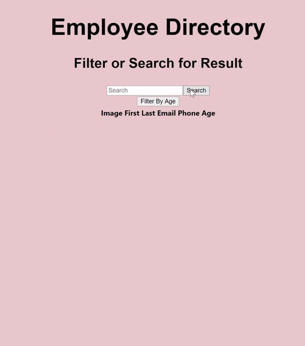

# edirect

## Table of contents

- [General info](#general-info)
- [Technologies](#Technologies)
- [Usage](#Usage)
- [Expectations](#Expectations)
- [Summary](#Summary)
- [Author](#Author)
- [License](#License)

## General info

Employee Directory React App where you are able to filter employees and view their information. 

## Technologies
- [HTML]
- [CSS]
- [JavaScript](https://www.javascript.com/)
- [React](https://reactjs.org/)
- [package.json](https://docs.npmjs.com/creating-a-package-json-file)
- [npm](https://www.npmjs.com/)

## Usage
- `$ npm install`
- `$ npm start`
- `Ctrl+C` stop running locally 

## Expectations

Link to React App : https://cheyennehunt99.github.io/edirect/

## Summary

This is a employee directory built with React which lets employers access employees information easily. A feature on this app also filters employees ages from least to greatest and etc!

## Author

Cheyenne Hunt

## License

Open Source